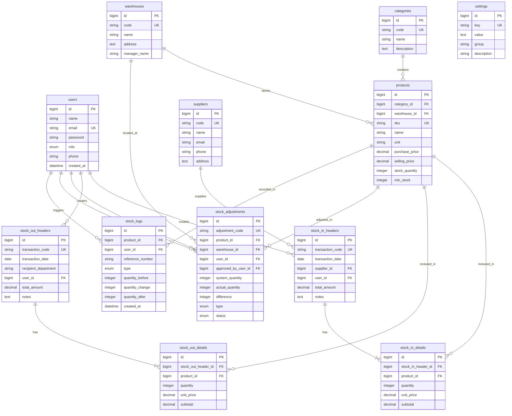

# Product Requirements Document (PRD)
## Sistem Informasi Inventaris Barang (Enterprise Inventory Management System)

**Dokumen Versi:** 1.0.0  
**Tanggal:** 22 Juli 2026  
**Penulis:** Senior Product Manager & Lead System Architect  
**Status:** Approved for Implementation  

---

## 1. Ringkasan Eksekutif & Latar Belakang

### 1.1 Latar Belakang
Pengelolaan inventaris barang pada perusahaan sering kali menghadapi tantangan seperti ketidakakuratan jumlah stok (*stock mismatch*), penelusuran mutasi barang yang lambat, kerugian akibat stok rusak/kedaluwarsa, hingga risiko hilangnya aset perusahaan. **Sistem Informasi Inventaris Barang (Enterprise Inventory Management System)** ini dirancang untuk memberikan visibilitas penuh (*end-to-end visibility*) terhadap arus keluar-masuk barang, pencatatan lokasi gudang yang presisi, kontrol stok opname yang terstruktur, serta audit trail otomatis untuk setiap mutasi inventaris.

### 1.2 Tujuan & Sasaran (Objectives)
1. **Otomatisasi & Presisi Stok**: Mengeliminasi pencatatan manual dan meminimalisir *human error* dalam perhitungan barang masuk dan keluar.
2. **Akuntabilitas & Traseabilitas**: Setiap perubahan stok tercatat dalam audit log otomatis (*Stock Logs*) lengkap dengan *user ID* dan *timestamp*.
3. **Efisiensi Manajerial**: Menyediakan pelaporan real-time, alert stok minimum, dan analitik nilai inventaris untuk pengambilan keputusan strategis.
4. **Skalabilitas**: Dirancang menggunakan arsitektur relasional 12 tabel yang mendukung pengelolaan multi-gudang dan histori transaksi skala menengah hingga besar.

---

## 2. Peran & Hak Akses Pengguna (User Roles & Access Control)

| Peran (Role) | Deskripsi | Hak Akses Utama |
| :--- | :--- | :--- |
| **Superadmin** | Pengelola penuh sistem | Akses penuh ke seluruh fitur, manajemen user, pengaturan sistem (`settings`), restore/backup data, dan konfigurasi master. |
| **Warehouse Manager** | Kepala bagian logistik & gudang | Mengelola master barang, menyetujui penyesuaian stok (*Stock Adjustment*), verifikasi transaksi *Stock In/Out*, serta memantau laporan analitik. |
| **Staff Gudang (Warehouse Staff)** | Petugas operasional | Input transaksi barang masuk (*Stock In*), transaksi barang keluar (*Stock Out*), dan pencatatan fisik stok opname. |
| **Auditor / Executive** | Pihak pemantau & manajemen | Akses *read-only* untuk melihat dashboard, kartu stok, laporan mutasi, dan statistik keuangan inventaris. |

---

## 3. Fitur Utama Aplikasi (Core Features)

### 3.1 Manajemen Master Data (Master Management)
- **Kategori Barang (`categories`)**: Pengelompokan hirarki barang (misal: Elektronik, Bahan Baku, Alat Tulis Kantor).
- **Pemasok (`suppliers`)**: Manajemen vendor, kontak, nomor telepon, dan alamat pemasok.
- **Gudang / Lokasi Storage (`warehouses`)**: Manajemen multi-gudang atau area rak penyimpanan (misal: Gudang Utama, Gudang Transit, Rak A1).
- **Master Barang (`products`)**: Data spesifikasi produk, SKU/Barcode, unit (Pcs, Box, Kg), harga beli, harga jual, stok saat ini, dan ambang batas stok minimum (*reorder level*).

### 3.2 Transaksi Penerimaan Barang / Inbound (`stock_in`)
- Pencatatan barang masuk dari supplier dilengkapi dengan nomor referensi/PO.
- Struktur Header (`stock_in_headers`) dan Detail (`stock_in_details`) untuk mendukung transaksi multi-item dalam satu resi.
- Otomatis menambah akumulasi stok produk dan mencatat riwayat mutasi.

### 3.3 Transaksi Pengeluaran Barang / Outbound (`stock_out`)
- Pencatatan barang keluar untuk kebutuhan produksi, divisi internal, atau penjualan.
- Validation guard untuk mencegah pengeluaran barang melebihi stok yang tersedia (*anti-negative stock*).
- Header (`stock_out_headers`) dan Detail (`stock_out_details`).

### 3.4 Stok Opname & Penyesuaian (`stock_adjustments`)
- Pencatatan perbedaan antara fisik stok di lapangan dengan sistem.
- Alasan penyesuaian (*Lost*, *Damaged*, *Opname Correction*).
- Memerlukan persetujuan (*approval*) dari Warehouse Manager sebelum stok resmi diperbarui.

### 3.5 Histori Mutasi & Audit Trail (`stock_logs`)
- Pencatatan otomatis setiap pergeseran stok (IN, OUT, ADJUSTMENT).
- Menyimpan *stok sebelum*, *perubahan*, dan *stok sesudah* untuk kepentingan audit.

### 3.6 Pengaturan & Konfigurasi Sistem (`settings`)
- Penyimpanan kunci-nilai (*key-value pairs*) untuk konfigurasi nama perusahaan, logo, format nomor resi otomatis, notifikasi ambang batas stok minimum, dan sistem mata uang.

---

## 4. Skema Data & Arsitektur Database (12 Tabel)

Sistem dirancang secara presisi menggunakan **12 tabel terintegrasi** berikut:

```
1. users
2. settings
3. categories
4. suppliers
5. warehouses
6. products
7. stock_in_headers
8. stock_in_details
9. stock_out_headers
10. stock_out_details
11. stock_adjustments
12. stock_logs
```

### 4.1 Penjelasan Naratif Struktur Tabel & Relasi

#### 1. Tabel `users`
Menyimpan informasi pengguna sistem, kredensial otentikasi, dan peran akses.
- **Fields**: `id`, `name`, `email`, `password`, `role` (Superadmin, Warehouse Manager, Staff, Auditor), `phone`, `remember_token`, `created_at`, `updated_at`.
- **Relasi**: Dihubungkan ke `stock_in_headers`, `stock_out_headers`, `stock_adjustments`, dan `stock_logs` sebagai *created_by* atau *approved_by*.

#### 2. Tabel `settings`
Menyimpan konfigurasi dinamis aplikasi dengan pola *Key-Value Store*.
- **Fields**: `id`, `key` (UNIQUE), `value`, `group` (system, notification, company), `description`, `created_at`, `updated_at`.

#### 3. Tabel `categories`
Klasifikasi kelompok jenis barang.
- **Fields**: `id`, `code` (UNIQUE), `name`, `description`, `created_at`, `updated_at`.
- **Relasi**: Memiliki banyak `products` (One-to-Many).

#### 4. Tabel `suppliers`
Data entitas vendor/pemasok barang.
- **Fields**: `id`, `code` (UNIQUE), `name`, `email`, `phone`, `address`, `created_at`, `updated_at`.
- **Relasi**: Terhubung ke `stock_in_headers` (One-to-Many).

#### 5. Tabel `warehouses`
Master lokasi gudang atau tempat penyimpanan barang.
- **Fields**: `id`, `code` (UNIQUE), `name`, `address`, `manager_name`, `created_at`, `updated_at`.
- **Relasi**: Memiliki banyak `products` dan `stock_adjustments` (One-to-Many).

#### 6. Tabel `products`
Master data utama barang/inventaris.
- **Fields**: `id`, `category_id`, `warehouse_id`, `sku` (UNIQUE), `name`, `unit` (pcs, box, unit), `purchase_price`, `selling_price`, `stock_quantity`, `min_stock`, `description`, `created_at`, `updated_at`.
- **Relasi**:
  - Belongs-to `categories` & `warehouses`.
  - Has-many `stock_in_details`, `stock_out_details`, `stock_adjustments`, dan `stock_logs`.

#### 7. Tabel `stock_in_headers`
Header dokumen transaksi barang masuk.
- **Fields**: `id`, `transaction_code` (UNIQUE), `transaction_date`, `supplier_id`, `user_id`, `total_amount`, `notes`, `created_at`, `updated_at`.
- **Relasi**:
  - Belongs-to `suppliers` & `users`.
  - Has-many `stock_in_details`.

#### 8. Tabel `stock_in_details`
Rincian item barang pada setiap transaksi barang masuk.
- **Fields**: `id`, `stock_in_header_id`, `product_id`, `quantity`, `unit_price`, `subtotal`, `created_at`, `updated_at`.
- **Relasi**: Belongs-to `stock_in_headers` & `products`.

#### 9. Tabel `stock_out_headers`
Header dokumen pengeluaran barang.
- **Fields**: `id`, `transaction_code` (UNIQUE), `transaction_date`, `recipient_department`, `user_id`, `total_amount`, `notes`, `created_at`, `updated_at`.
- **Relasi**:
  - Belongs-to `users`.
  - Has-many `stock_out_details`.

#### 10. Tabel `stock_out_details`
Rincian item barang pada transaksi barang keluar.
- **Fields**: `id`, `stock_out_header_id`, `product_id`, `quantity`, `unit_price`, `subtotal`, `created_at`, `updated_at`.
- **Relasi**: Belongs-to `stock_out_headers` & `products`.

#### 11. Tabel `stock_adjustments`
Pencatatan penyesuaian stok (*opname*) untuk menangani selisih stok fisik dan sistem.
- **Fields**: `id`, `adjustment_code` (UNIQUE), `product_id`, `warehouse_id`, `user_id`, `approved_by_user_id`, `system_quantity`, `actual_quantity`, `difference`, `type` (ADDITION, SUBTRACTION), `reason`, `status` (PENDING, APPROVED, REJECTED), `created_at`, `updated_at`.
- **Relasi**: Belongs-to `products`, `warehouses`, dan `users`.

#### 12. Tabel `stock_logs`
Catatan mutasi stok historis otomatis (Audit Log).
- **Fields**: `id`, `product_id`, `user_id`, `reference_number`, `type` (IN, OUT, ADJUSTMENT), `quantity_before`, `quantity_change`, `quantity_after`, `notes`, `created_at`.
- **Relasi**: Belongs-to `products` & `users`.

---

### 4.2 Visualisasi Entity-Relationship Diagram (ERD)

Berikut adalah diagram relasi antartabel dalam format **Mermaid**:



---

## 5. Arsitektur Teknis & Stack Teknologi

- **Backend Framework**: Laravel 13 (PHP 8.3+)
- **Frontend / UI**: HTML5, Blade Templates, TailwindCSS & NiceAdmin Bootstrap Theme
- **Database**: SQLite (Development & Testing) / PostgreSQL atau MySQL (Production)
- **Asset Bundler**: Vite 7
- **Authentication**: Laravel Built-in Session Authentication & Middleware Role Checking
- **Reporting Engine**: Barryvdh Laravel DomPDF (Eksport PDF Laporan Stok & Resi Transaction)

---

## 6. Persyaratan Non-Fungsional (Non-Functional Requirements)

1. **Performansi**: Respon halaman < 1.5 detik untuk pencarian produk dan render laporan.
2. **Keamanan Data**:
   - Enkripsi password menggunakan `Bcrypt` (rounds 12).
   - Perlindungan komprehensif dari *Cross-Site Request Forgery (CSRF)* dan *SQL Injection* via Laravel Eloquent ORM.
   - Hak akses berbasis peran (*Role-Based Access Control / RBAC*).
3. **Integritas Data**: Menggunakan *Database Transactions* (`DB::transaction`) untuk memastikan operasi simpan pada header & detail bersifat atomik (*ACID Compliant*).
4. **Ketersediaan & Audit**: Setiap perubahan stok barang dicatat permanen di `stock_logs` dan tidak boleh dapat dihapus (*Append-Only Audit Log*).

---

## 7. Rencana Pelaksanaan & Milestone

- **Fase 1: Database Setup & Master Data**  
  Membuat 12 migration files, Eloquent Models, Seeder, dan CRUD Master (Barang, Kategori, Supplier, Warehouse, Settings).
- **Fase 2: Transaksi Stock In & Stock Out**  
  Mengimplementasikan form transaksi dinamis header-detail, kalkulasi otomatis subtotal, dan pencatatan mutasi ke `stock_logs`.
- **Fase 3: Stock Opname & Approval System**  
  Modul penyesuaian stok, mekanisme approval manager, serta laporan selisih stok.
- **Fase 4: Reporting, Export PDF, & UI Polish**  
  Penyempurnaan tampilan dengan NiceAdmin Bootstrap, integrasi grafik dashboard, dan modul ekspor laporan PDF.
